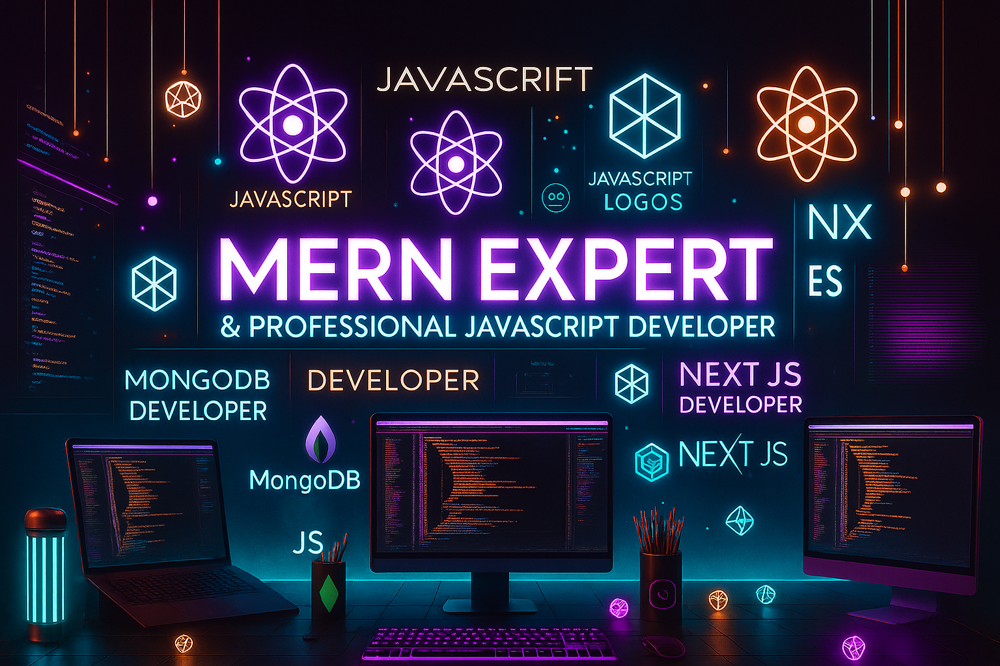

Great to see you here! Yes, you're exactly where you needed to be 🎉

<h1 align="center">
    
</h1>

💻 **Software Engineer | JavaScript Developer | MERN Stack Specialist**
Creating fast, scalable, and responsive web applications that solve real-world problems.

<h1></h1>

### 🔭 Currently At

**Software Engineer at [Pronet](https://pronet-tech.net)**, working on enterprise-scale platforms using:
- **JavaScript / TypeScript**
- **MERN Stack (MongoDB, Express.js, React, Node.js)** 
- **Vite.js, Next.js, and other cutting-edge web tech.**
  
### ☁️ Learning & Exploring

Currently sharpening my skills in:
- **Microsoft Azure**, **AWS**, **GCP**
- **Next.js**, **React Native**

### 📂 Portfolio & Resume

- 🔗 [**Portfolio Website**](https://saadziauddin.vercel.app)
- 📄 [**View My Resume**](https://drive.google.com/file/d/1r3B-O4AaO5qiJFbybOzyppDhKtdQH-QM/view?usp=drive_link)

### 📫 Contact Me

- ✉️ Email: **saad.ziauddin07@gmail.com**
- 💼 LinkedIn: [linkedin.com/in/your-link](https://linkedin.com/in/saad-ziauddin)
  
🚀 Cheers to endless loops and bug-free adventures! 🔥
  
⚡ Fun fact: **Merge Conflicts 😅 Character Building**

<h1></h1>

## ✍️ Random Dev Quote

## 🚀 Technologies & Tools

**Frontend**

**Backend**

**DevOps & Hosting**

 

**Version Control & CI/CD**

**Design Tools**

 

**Other Tools**

 

## 📊 GitHub Stats:
 
 

## 🔝 Top Contributed Repo

## Roadmap

---

